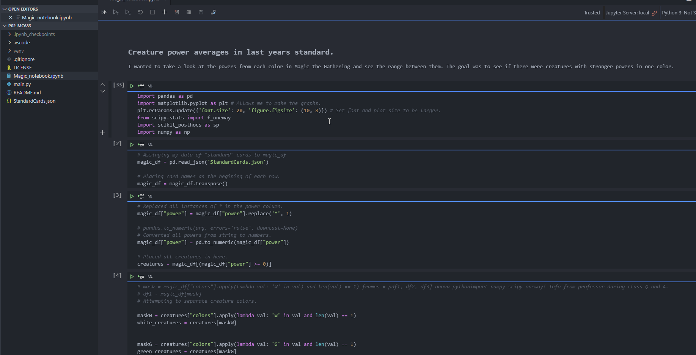

# Data Analysis of Magic the Gathering Cards.
This will contain the dataset of the standard cards (last year's standard) that could have been played in the format.
The following libraries were used:
```
pip install pandas
pip install jupyterlab
pip install matplotlib
pip install numpy
pip install scipy.stats
pip install scikit_posthoc
```

The information that you will find in the magic jupyter notebook will be about each color's power distribution.
A question we asked was "Are there more green creatures with higher powers then the creatures of other colors?"
From the data provided we can see the power distribution for all of the colors given in the data.

We can also formulate other questions as well, such as "What is the relation between power and toughness?",
"which color has more sorcery/instance spells?", "which color has the most creatures?".

# Scroll through of data.



For this project though I looked mainly to see if one color had more creatures of higher power than the others. The data showed that some colors did have creatures that
went to a higher power than some of the other colors, but those were mostly extreme cases and weren't plentiful. What I ended up doing then was just seeing the average
of each color's powers and it turns out that green had the higher average, followed by what looks like a tie between red and black, then white, and lastly blue.
These were just based on the averages though and while I attempted to show this by using regression I wasn't able to properly do so. I believe what the single regression attempt
that yielded results was just two numbers with the one showing significant difference at 0.006.
